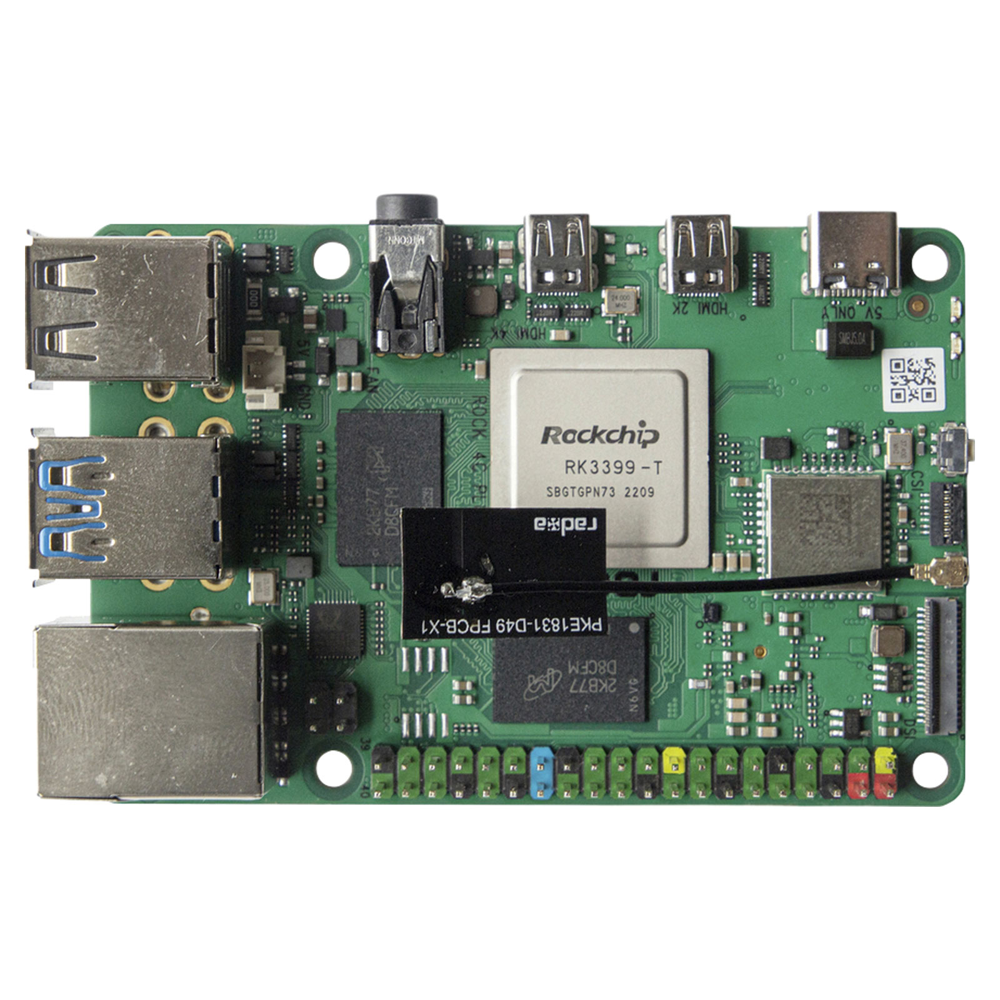

# Klipper-Rock4c-
This guide walks you through running Klipper + Moonraker + Mainsail on a Rock Pi 4C+ using DietPi as the base OS. It’s optimized for lightweight, headless 3D printer control.
Full guide in Klipper Rock4c+.md

